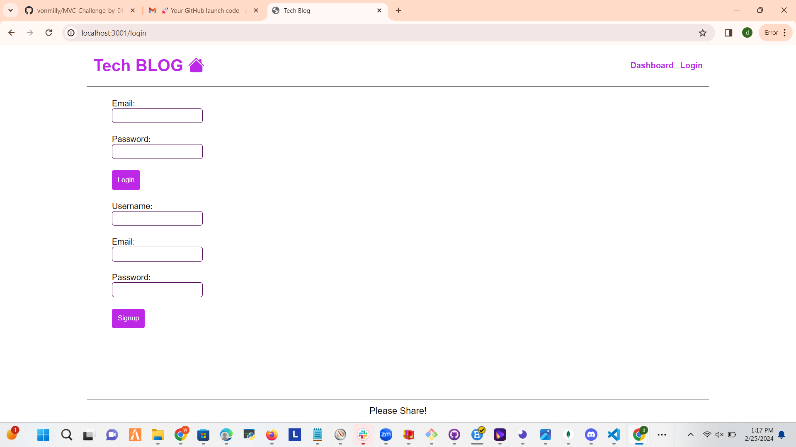
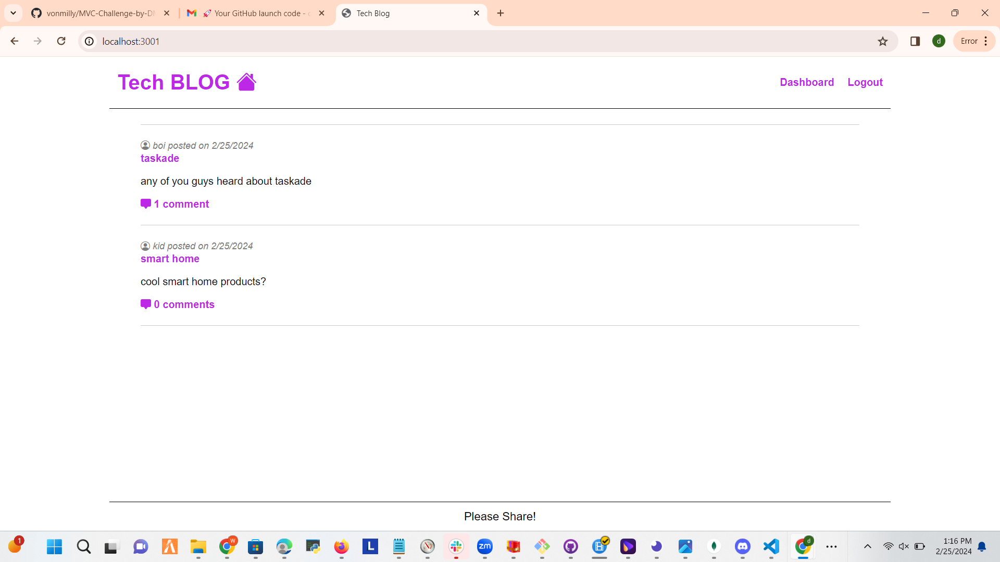
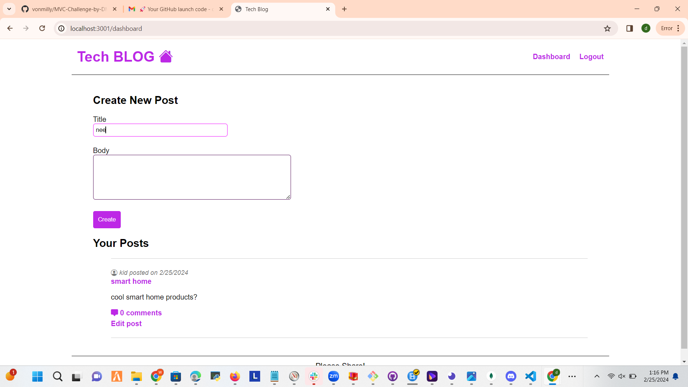
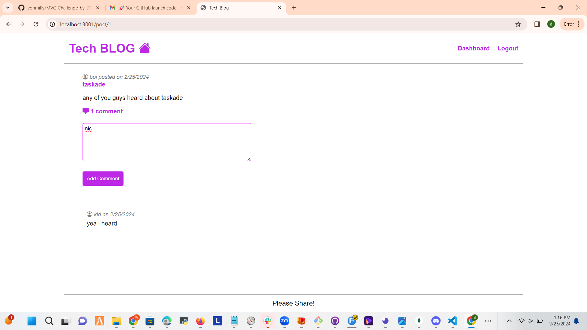

# MVC Challenge Tech Blog Site

## Table of Contents
- [Description](#description)
- [Installation](#installation)
- [Usage](#usage)
- [Features](#features)
- [Challenges Faced](#challenges-faced)
- [Author](#author)

## Description
This CMS-style blog site allows users to view, post, comment on, and interact with blog posts. Built with a modern tech stack, including Express.js for the backend and Sequelize ORM for MySQL database interaction, it supports full CRUD operations for managing blog posts and comments in a user-friendly web interface.

## Installation
1. Clone the repository: `git clone https://github.com/vonmilly/MVC-Challenge-by-DM.git`
2. Navigate to the project directory: `cd MVC-Challenge-by-DM`
3. Install dependencies: `npm i`
4. Create a `.env` file and add your database name, MySQL username, and MySQL password as environment variables.

## Usage
1. Ensure your database name, MySQL username, and MySQL password are correctly set in the `.env` file.
2. Run the `npm run seed` command to seed the database with initial data.
3. Start the application with `npm start`; navigate to the provided local URL in your browser.
4. Explore the features of the blog site, including viewing posts, signing up, logging in, and interacting with content.

## Screenshots

## Features
- **Homepage**: View existing blog posts with titles and creation dates. Navigation links for homepage, dashboard, and login/logout up are available if logged in or logged out.
- **User Authentication**: Sign up to create an account or log in with existing credentials to interact with blog posts fully.
- **Dashboard**: Once logged in, access the dashboard to view, create, update, or delete your blog posts.
- **Comments**: Add comments to blog post on the homepage to engage with the community. Comments display the creator's username and creation date.
- **Logout**: Securely log out of the site, with an auto-logout feature for idle users to maintain security.

## Challenges Faced
- **User Authentication**: Implementing a secure and efficient user authentication system for signing up, logging in, and auto-logout on inactivity.
- **CRUD Operations**: Ensuring seamless CRUD operations for blog posts and comments within the CMS interface.
- **UI/UX Design**: Designing an intuitive and responsive user interface that provides an excellent user experience across various devices.

## Deployed Application link
https://tech-blog-by-dm-a627a939e46e.herokuapp.com/

## Author
### Devonte Miller
